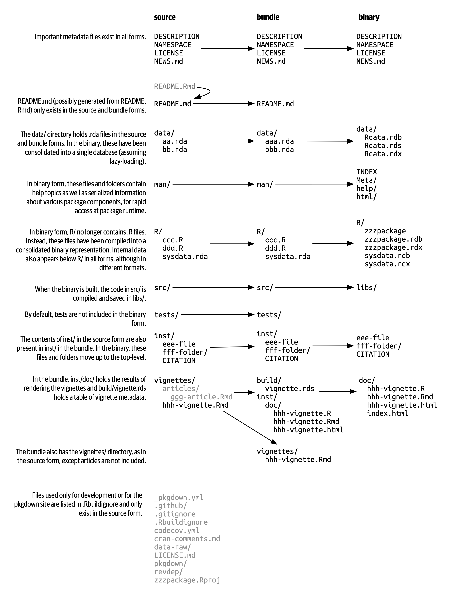

# Package structure and state {#sec-package-structure-state}

```{r, echo = FALSE}
source("common.R")
```

本章将通过把您从使用 R 包中获得的隐性知识转换为创建和修改它们所需的显式知识，从而开始开发程序包。
您将了解程序包（package）的各种状态，以及它和库（library）之间的区别（以及为什么要关心二者的区别）。


## Package states {#sec-package-states}

当你创建或修改一个包时，需要在它的源代码（"source code"）或源文件（"source files"）上进行。
您能够以源代码（**source**）的形式与正在开发的程序包进行交互。
这不是您在日常使用中最熟悉的包形式。
如果您了解 R 程序包可能处于的五种状态，那么程序包开发的工作流将变得更有意义：

- 源代码（source）
- 捆绑的（bundled）
- 二进制文件（binary）
- 已安装的（installed）
- 载入内存中的（in-memory）

您已经知道一些将程序包转入这些状态的函数。
例如，`install.packages()` 可以将包从源码（source）、捆绑（bundled）或二进制（binary）状态移动到已安装（installed）状态。
`devtools::install_github()` 获取 GitHub 上的源码（source）包并将其移至已安装（installed）状态。
`library()` 函数的作用是：将已安装的程序包加载到内存中，以便可以马上直接使用。


## Source package {#sec-source-package}

一个源码（**source**）程序包就是一个有着特定结构的文件目录。
它包含特定的组件，例如一个 `DESCRIPTION` 文件、包含 `.R` 文件的 `R/` 目录等。
本书余下的大部分章节都致力于详细说明这些组成部分。

如果您刚刚接触 R 程序包的开发，那么您可能从未见过源码（source）形式的程序包！
您的计算机上可能甚至没有任何源码程序包。
以源码形式查看程序包的最简单的方法是在 web 上浏览其代码。

许多 R 程序包是在 GitHub（或者 GitLab 以及类似的平台）上的公开库中开发的。
最好的方案是访问程序包的 CRAN 主页，例如：

-   forcats: <https://cran.r-project.org/package=forcats>
-   readxl: <https://cran.r-project.org/package=readxl>

并且其中一个网页链接（URLs）链接到公共托管服务上的存储库（repository），例如：

-   forcats: <https://github.com/tidyverse/forcats>
-   readxl: <https://github.com/tidyverse/readxl>

即使程序包是在公共存储库中开发的，一些维护人员还是忘记了列出这个网页链接（URL），但是您仍然可以通过搜索来发现它。

即使程序包不是在公共平台上开发的，也可以在 [unofficial, read-only mirror maintained by R-hub](https://docs.r-hub.io/#cranatgh) 中访问其源代码。
示例：

-   MASS: <https://github.com/cran/MASS>
-   car: <https://github.com/cran/car>

请注意，在 `cran` GitHub 组织内探索包的源码和历史记录与探索包的真正开发场所不同，因为此源码及其演变只是从包的 CRAN 版本进行逆向工程。
它提供了对程序包及其开发历史的审查视图，但根据定义，源代码及其历史包含了所有程序包开发的必需的内容。


## Bundled package {#sec-bundled-package}

捆绑的（**bundled**）程序包是被压缩成单个文件的程序包。
按照惯例（该惯例来自 Linux），R 中的捆绑程序包使用 `.tar.gz` 扩展名，并且有时被称为源码压缩包（"source tarballs"）。
这意味着多个文件已经被打包为一个文件（`.tar`）并使用 gzip（`.gz`）进行压缩。
虽然捆绑程序包本身并不那么有用，但它是源码包和已安装包之间平台无关的、便于传输的中间媒介。

在从本地开发的程序包中生成捆绑程序包这种罕见的情况下，请使用 `devtools::build()`。
在幕后，它会调用 `pkgbuild::build()` 并最终调用 `R CMD build`，这些会在 [Writing R Extensions](https://cran.r-project.org/doc/manuals/R-exts.html) 的 [Building package tarballs](https://cran.r-project.org/doc/manuals/R-exts.html#Building-package-tarballs) 部分中进一步阐述。

这应该会提醒您，捆绑程序包或源码压缩包不仅仅是对源文件进行 tar 打包存档，然后使用 gzip 压缩的结果。
按照惯例，在 R 世界中，在制作 `.tar.gz` 文件时还要执行一些操作。
这就是我们选择将其称为捆绑（**bundle**）程序包的原因。

每个 CRAN 包都可以通过其登陆页面的 "Package source" 字段以捆绑（bundled）形式提供。
继续我们上面的示例，您可以下载 `forcats_0.4.0.tar.gz` 和 `readxl_1.3.1.tar.gz` 的捆绑包（或者任何当前的版本）。
您可以在 shell（而不是 R 控制台）中进行解压缩：

``` bash
tar xvf forcats_0.4.0.tar.gz
```

如果您解压缩一个捆绑包，您将看到它看起来几乎与源码包相同。
@fig-package-files 显示了名为 zzzpackage 的虚构包的源码（source）、捆绑（bundled）、二进制（binary）形式的文件。
我们特意制作了这个示例，以包含本书中涵盖的大部分包部分。
并非每个包都包含此处看到的每个文件，此图也不包含可能出现在包中的每个可能文件。

```{r}
#| label: fig-package-files
#| echo: false
#| out-width: ~
#| fig-cap: >
#|   Package forms: source vs. bundled vs. binary.
#| fig-alt: >
#|   Side-by-side comparison of source, bundled, and binary package. 
#|   The flow of files (location and format) from package source to 
#|   bundled to binary state is shown. This is described in
#|   detail in the appropriately named sections of this chapter.

```

源码（source）包和未压缩的捆绑（bundle）包之间的主要区别为：

-   已经生成了 Vignettes，因此以已渲染的输出（如 HTML）出现在 `inst/doc/` 目录下，并且 Vignette 索引出现在 `build/` 目录中。

-   本地源码包可能包含用于在开发期间节省时间的临时文件，如 `src/` 中的编译文件。
    这些文件从来没有在捆绑包中找到过。

-   `.Rbuildignore` 中列出的任何文件都不包含在捆绑包中。
    这些文件通常有助于您的开发过程，但应该从分发式的产品中排除。

### `.Rbuildignore` {#sec-rbuildignore}

您不需要非常频繁地考虑 `.tar.gz` 文件形式的程序包的确切结构，但您确实需要了解 `.Rbuildignore` 文件。
它决定了源码包中的哪些文件可以进入后面的工作流。

`.Rbuildignore` 的每一行都是与 Perl 兼容的正则表达式，不考虑大小写，它与源码包中每个文件的路径匹配[^structure-1]。
如果与正则表达式匹配，则排除该文件或目录。
注意，有一些默认排除项由 R 本身执行，主要与经典的版本控制系统和编辑器（如 SVN、Git 和 Emacs）有关。

[^structure-1]: 要查看应该在您的雷达上的文件路径集，请在包的顶级目录中执行 `dir(full.names = TRUE, recursive = TRUE, include.dirs = TRUE, all.files = TRUE)` 。

我们通常使用 `usethis::use_build_ignore()` 函数修改 `.Rbuildignore`，它负责处理容易忘记的细节，例如正则表达式锚定和转义。
要排除特定文件或目录（最常见的使用示例），您必须锚定（anchor）正则表达式。
例如，要排除名为 "notes" 的目录，`.Rbuildignore` 条目必须是 `^notes$`，而未锚定的正则表达式 `notes` 将匹配任何包含 "notes" 的文件名，例如 `R/notes.R`、`man/important-notes.R`、`data/endnotes.Rdata` 等。
我们发现 `use_build_ignore()` 可以帮助我们一次性获得更多的 `.Rbuildignore` 条目。

`.Rbuildignore` 是解决让您更便利地开发的操作与 CRAN 提交和分发的要求之间一些紧张关系的一种方法 (@sec-release)。
即使您不打算在 CRAN 上发布，遵循这些约定能让您最好地使用 R 的内置工具来检查和安装程序包。
你应该 `.Rbuildignore` 的文件分为两个广泛的、半重叠的类别：

-   帮助您以编程方式生成程序包内容的文件。例如：
    -   使用 `README.Rmd` 生成信息丰富的最新 `README.md`（@sec-readme）。
    -   存储 `.R` 脚本以创建和更新内部或导出数据（@sec-data-data-raw）。
-   驱动程序包开发、检查和产生文档的文件，不在 CRAN 的范围内。例如：
    -   与 RStudio IDE 相关的文件（@sec-workflow101-rstudio-projects）。
    -   使用 [pkgdown package](https://pkgdown.r-lib.org/) 生成网站（@sec-website）。
    -   与持续集成/部署相关的配置文件（@sec-sw-dev-practices-ci）。

以下是 tidyverse 中程序包的 `.Rbuildignore` 文件中典型条目的非完整列表：

```         
^.*\.Rproj$         # Designates the directory as an RStudio Project
^\.Rproj\.user$     # Used by RStudio for temporary files
^README\.Rmd$       # An Rmd file used to generate README.md
^LICENSE\.md$       # Full text of the license
^cran-comments\.md$ # Comments for CRAN submission
^data-raw$          # Code used to create data included in the package
^pkgdown$           # Resources used for the package website
^_pkgdown\.yml$     # Configuration info for the package website
^\.github$          # GitHub Actions workflows
```

请注意，上面的注释不能出现在实际的 `.Rbuildignore` 文件中；此处包含这些注释只是为了演示。

我们会在需要的时候提到何时需要向 `.Rbuildignore` 中添加排除项。
请记住 `usethis::use_build_ignore()` 是管理此文件的一种有吸引力的方法。
此外，许多使用此功能添加应在 `.Rbuildignore` 中列出的文件会自动处理此问题。
例如，`use_read_rmd()` 将 "\^README\\.Rmd\$" 添加到 `.Rbuildignore`。


## Binary package {#sec-structure-binary}

如果要将程序包分发给没有程序包开发工具的 R 用户，则需要提供二进制（**binary**）包。
二进制包的主要制造者和分发者是 CRAN，而不是个人维护者。
但是，即使您将分发包的责任委托给 CRAN，维护者了解二进制包的性质仍然很重要。

与捆绑包一样，二进制包是单个文件。
与捆绑包不同，二进制包是特定于平台的，有两种基本风格：Windows 和 macOS。
（Linux 用户通常需要拥有从 `.tar.gz` 文件安装所需的工具，尽管像 [Posit Public Package Manager](https://packagemanager.posit.co/) 这样的资源的出现让 Linux 用户可以像他们在 Windows 和 macOS 上的同事一样访问二进制包。）

macOS 的二进制包存储为 `.tgz`，而 Windows 二进制包以 `.zip` 结尾。
如果需要制作二进制包，请在相关操作系统上使用 `devtools::build(binary = TRUE)`。
在幕后，这会调用 `pkgbuild::build(binary = TRUE)` 并最终调用 `R CMD INSTALL --build`，这在 [Writing R Extensions](https://cran.r-project.org/doc/manuals/R-exts.html) 的 [Building binary packages](https://cran.r-project.org/doc/manuals/R-exts.html#Building-binary-packages) 部分中有进一步描述。
如果你选择在 CRAN 上发布你的包（@sec-release），你以捆绑形式提交你的包，然后 CRAN 创建并分发包二进制文件。

不论是 macOS 或 Windows，还是 R 的当前、先前和（可能的）开发版本，CRAN 通常都能以二进制包形式提供。
继续我们上面的例子，您能够下载二进制包，例如：

-   forcats for macOS: `forcats_0.4.0.tgz`
-   readxl for Windows: `readxl_1.3.1.zip`

事实上，这是您在调用 `isntall.packages()` 时通常进行的部分幕后操作。

如果解压缩二进制包，您将看到它的内部结构与源码包或捆绑包有很大不同。
@fig-package-files 包含了二者的比较。
以下是一些最显著的区别：

-   在 `R/` 目录中没有 `.R` 文件，而是有三个文件以有效的文件格式存储着解析的函数。
    这基本上是加载所有 R 代码，然后用 `save()` 保存函数的结果。
    （在这个过程中，这会添加一些额外的 metadata，使得过程尽可能地快）。

-   `Meta/` 目录中包含许多 `.rds` 文件。
    这些文件包含有关包的缓存 metadata，如帮助文件所涵盖的主题和 `DESCRIPTION` 文件的解析版本。
    （您可以使用 `readRDS()` 查看这些文件中的内容）。
    这些文件通过缓存代价高昂的计算使程序包更快地加载。

-   实际的帮助内容出现在 `help/` 和 `html/`（不再出现在 `man/`）中。

-   如果 `src/` 目录中有任何代码，那么现在将有一个 `libs/` 目录，其中包含经过编译的代码。

-   如果 `data/` 中有任何对象，则它们现在已转换为更具效率的形式。

-   `inst/` 的内容被移动到顶层目录。
    例如，vignette 文件现在位于 `doc/` 中。

-   一些文件和文件夹已被删除，如 `README.md`、`build/`、`tests/` 和 `vignettes/`。


## Installed package {#sec-installed-package}

已安装的（**installed**）包是已解压缩到程序包库中的二进制包（described in @sec-library）。
@fig-installation 说明了安装程序包的多种方法，以及将软件包从一种状态转换为另一种状态的一些其他函数。
这个图表很复杂！在理想情况下，安装包需要将一组简单的步骤串在一起：source -\> bundle, bundle -\> binary, binary -\> installed。
在现实世界中，这个过程并不是这么简单，因为通常有（更快的）快捷方式可用。

```{r}
#| label: fig-installation
#| echo: false
#| out-width: ~
#| fig-cap: >
#|   Many methods for converting between package states.
#| fig-alt: > 
#|   A chart showing different ways to go from one package state to another:
#|   1. library() puts an installed package into memory.
#|   2. Functions such as install.packages(),
#|      devtools::install_github(), and devtools::install()
#|      can install a package starting variously in the source,
#|      bundle, or binary forms.
#|   3. devtools::build() can create a bundle or a binary.
#|   4. devtools::load_all() puts a source package into memory.
knitr::include_graphics("diagrams/install-load.png")
```

内置命令行工具 `R CMD INSTALL` 支持所有程序包的安装。
它可以从源码文件、捆绑包、或二进制包安装程序包。
有关详细信息，请参阅 [R Installation and Administration](https://cran.r-project.org/doc/manuals/R-admin.html) 的 [Installing packages](https://cran.r-project.org/doc/manuals/R-admin.html#Installing-packages) 部分。
与 `devtools::build()` 一样，devtools 提供了一个包装函数 `devtools::install()`，使该工具在 R 会话（R Session）中可用。

::: callout-tip
## RStudio

RStudio 可以帮助您安装开发中的包，通过 *Build* 窗格中的 *Install* 和 *More* 下拉菜单以及 *Build* 菜单中的 *Install Package*。
:::

可以理解，大多数用户喜欢 R 会话（R Session）的舒适性，因此直接从 CRAN 安装软件包。
内置函数 `install.packages()` 满足了这一需要。
它可以以各种形式下载程序包并安装它，还可以选择程序包依赖项的安装。

然而，从 R 会话中安装 R 包的便利性是有代价的。
如您所料，重新安装已在当前会话中使用的包可能有点棘手。
这实际上大部分时间都有效，但有时却无效，尤其是在 Windows 上安装带有编译代码的 R 包时。
由于文件句柄在 Windows 上的锁定方式，尝试安装正在使用的包的新版本可能会导致安装损坏，其中包的 R 代码已更新，但其编译代码尚未更新。
排除故障时，Windows 用户应努力在干净的 R 会话中安装包，并加载尽可能少的包。

pak 包 (<https://pak.r-lib.org/>) 相对较新（在撰写本文时），它提供了一个有前途的替代 `install.packages()` 以及其他更专业的功能，例如 `devtools::install_github()`。
现在全面推荐使用 pak 来满足您的所有软件包安装需求还为时过早，但我们肯定在我们的个人工作流程中越来越多地使用它。
pak 的旗舰功能之一是它很好地解决了上述 "locked DLL" 问题，即在 Windows 上使用编译代码更新包。
随着您对包开发的深入，您会发现自己正在执行一组全新的任务，例如从开发中的分支安装依赖项或仔细检查包依赖项树。
pak 为这个任务和许多其他相关任务提供了一个丰富的工具包。
我们预计 pak 将很快成为我们关于如何安装软件包（以及更多）的官方推荐。

然而，与此同时，我们描述了现状。
devtools 长期以来一直提供一系列 `install_*()` 函数来解决一些超出 `install.packages()` 范围的需求，或者使现有功能更容易访问。
这些功能实际上是在 [remotes package](https://remotes.r-lib.org/) 中维护的，并由 devtools 重新导出。
（鉴于我们上面所说的，remotes 很可能会在本质上被取代，取而代之的是 pak，但我们还没有到那一步。）

```{r}
library(remotes)

funs <- as.character(lsf.str("package:remotes"))
grep("^install_.+", funs, value = TRUE)
```

`install_github()` 是这些函数中最有用的一个，也显示在 @fig-installation 中。
它是一系列功能的最佳示例，可以从非 CRAN 的远程位置下载包，并执行安装包所需的任何操作。
其余的 devtools/remotes `install_*()` 函数旨在使基本工具在技术上更简单或更明确一些，例如 `install_version()`，它能够安装特定版本的 CRAN 包。

与 `.Rbuildignore` 类似，如 @sec-rbuildignore 所述，`.Rinstignore` 允许您将捆绑包中的文件保留在已安装包之外。
然而，与 `.Rbuildignore` 相反，这个功能相当模糊，而且很少需要这样做。


## In-memory package

我们终于讲述到了一个每个使用 R 的人都熟悉的命令。

```{r, eval = FALSE}
library(usethis)
```

假设已经安装了 usethis，这个语句将使得里面的所有函数可用，即现在我们可以执行以下操作：

```{r, eval = FALSE}
create_package("/path/to/my/coolpackage")
```

这样，usethis 包已加载到内存中，并且实际上也已附加到搜索路径。
在编写脚本时，加载和附加程序包之间的区别并不重要，但在编写程序包时非常重要。
您将在 @sec-dependencies-attach-vs-load 中了解更多关于差异及其重要性的信息。

`library()` 并不是迭代调整和测试正在开发的程序包的好方法，因为它只适用于已安装的包。
在 @sec-workflow101-load-all 中，您将了解 `devtools::load_all()` 如何通过允许您将源码包直接加载到内存中来加速开发过程。


## Package libraries {#sec-library}

我们刚刚讨论了 `library()` 函数，它的名字源于它的作用。
当你调用 `library(somepackage)` 时，R 会在当前 **libraries** 中查找一个叫做 "somepackage" 的已安装包，如果成功了，R 将让 somepackage 变得可以使用。

在 R 中，一个 **library** 就是一个包含了已安装程序包的目录，有点像图书库。
不幸的是，在 R 的世界，您将会经常遇到 "library" 和 "package" 的混淆用法。
例如，dplyr 是一个 package，但是通常有人将其称为一个 library。
造成这种混乱的原因有几个。
首先，R 的术语可以说是与更广泛的编程约定背道而驰的，"library" 的通常含义更接近于我们所说的 "package"。
`library()` 函数本身的名称可能会强化这一错误的关联。
最后，这种词汇错误通常是无害的，因此 R 用户很容易养成错误的习惯，而指出这个错误的人看起来像是令人无法忍受的学究。
但底线是：

> 我们使用 `library()` 函数加载一个 **package**[^structure-2]。

[^structure-2]: 嗯，实际上，`library()` 加载并附加一个 package，但这是 @sec-dependencies-attach-vs-load 的主题。

当您参与包开发时，两者之间的区别是重要且有用的。

您的计算机上可以有多个 libraries。
事实上，你们中的很多人已经这样做了，尤其是在 Windows 上。
可以使用 `.libPaths()` 查看当前处于活动状态的 libraries。
在 Windows 上看起来如下：

```{r, eval = FALSE}
# on Windows
.libPaths()
#> [1] "C:/Users/jenny/Documents/R/win-library/4.2"
#> [2] "C:/Program Files/R/R-4.2.2/library"

lapply(.libPaths(), list.dirs, recursive = FALSE, full.names = FALSE)
#> [[1]]
#>   [1] "abc"           "anytime"       "askpass"       "assertthat"   
#>  ...
#> [145] "zeallot"      
#> 
#> [[2]]
#>  [1] "base"         "boot"         "class"        "cluster"     
#>  [5] "codetools"    "compiler"     "datasets"     "foreign"     
#>  [9] "graphics"     "grDevices"    "grid"         "KernSmooth"  
#> [13] "lattice"      "MASS"         "Matrix"       "methods"     
#> [17] "mgcv"         "nlme"         "nnet"         "parallel"    
#> [21] "rpart"        "spatial"      "splines"      "stats"       
#> [25] "stats4"       "survival"     "tcltk"        "tools"       
#> [29] "translations" "utils"
```

在 macOS 上看起来类似（但您的结果可能会有所不同）:

```{r, eval = FALSE}
# on macOS
.libPaths()
#> [1] "/Users/jenny/Library/R/arm64/4.2/library"
#> [2] "/Library/Frameworks/R.framework/Versions/4.2-arm64/Resources/library"

lapply(.libPaths(), list.dirs, recursive = FALSE, full.names = FALSE)
#> [[1]]
#>    [1] "abc"                  "abc.data"             "abind"                
#>  ...
#> [1033] "Zelig"                "zip"                  "zoo"                 
#> 
#> [[2]]
#>  [1] "base"         "boot"         "class"        "cluster"     
#>  [5] "codetools"    "compiler"     "datasets"     "foreign"     
#>  [9] "graphics"     "grDevices"    "grid"         "KernSmooth"  
#> [13] "lattice"      "MASS"         "Matrix"       "methods"     
#> [17] "mgcv"         "nlme"         "nnet"         "parallel"    
#> [21] "rpart"        "spatial"      "splines"      "stats"       
#> [25] "stats4"       "survival"     "tcltk"        "tools"       
#> [29] "translations" "utils"
```

在这两种情况下，我们可以看到两个活动库，它们的查询顺序如下：

1.  用户库
2.  系统级或全局库

这样的设置是 Windows 上的经典设置，但通常是 macOS 和 Linux 上需要选择的设置[^structure-3]。
在这样的设置之下，从 CRAN（或其他地方）安装的或本地开发的附加程序包保存在用户库中。
和上面一样，macOS 系统被用作主要的开发机器，这里有很多软件包（\~1000），而 Windows 系统只是偶尔使用，而且要简朴得多。
R 附带的基本和推荐程序包的核心集位于系统级库中，这一点在 macOS 和 Windows 上是相同的。
这种分离对许多开发人员很有吸引力，例如，在不干扰 base R 的安装的情况下使得清理附加包变得很容易。

[^structure-3]: 有关更多详细信息，请参阅 *What They Forgot To Teach You About R* 中的 [Maintaining R section](https://whattheyforgot.org/maintaining-r.html#how-to-transfer-your-library-when-updating-r) 部分、*R Installation and Administration* 中的 [Managing Libraries](https://rstudio.github.io/r-manuals/r-admin/Add-on-packages.html#managing-libraries) 以及 `?Startup` 和 `?.libPaths` 的 R 帮助文件。

如果您在 macOS 或 Linux 上只看到一个库，并不需要紧急更改任何内容。
但下次升级 R 时，请考虑创建一个用户级库。
默认情况下，R 查找存储在环境变量 `R_LIBS_USER` 中的路径下的用户库，在 macOS 上默认为 `~/Library/R/x.y/library`，在 Linux 上默认为 `~/R/m-library/x.y`（其中 `m` 是 CPU 架构的简明描述，`x.y` 是 R 版本）。
您可以使用 `Sys.getenv("R_LIBS_USER")` 查看此路径。
默认情况下这些目录不存在，必须通过创建目录来启用它们。
安装新版本的 R 时，在安装任何附加包之前，请使用 `dir.create(Sys.getenv("R_LIBS_USER"), recursive = TRUE)` 在默认位置创建用户库。
现在您将拥有上面看到的库设置。
或者，您可以在其他地方设置用户库，并通过在 `.Renviron` 中设置 `R_LIBS_USER` 环境变量来告诉 R。
编辑 `.Renviron` 文件的最简单方法是使用 `usethis::edit_r_environ()`，如果文件不存在，它将创建该文件，并打开它进行编辑。

这些库的文件路径也清楚地表明它们与特定版本的 R（在编写本文时是 4.2.x）相关联，这也是经典的。
这反映并强化了这样一个事实：当您将 R 从 4.1 更新到 4.2，即一个在次要（**minor**）版本上的更改时，您需要重新安装附加程序包。
对于在补丁（**patch**）版本上的更改，例如从 R 4.2.1 到 4.2.2，通常不需要重新安装附加程序包。

随着 R 的使用变得越来越复杂，开始更加有意地管理程序包库是十分平常的。
例如，像 [renv](https://rstudio.github.io/renv/)（及其前身 [packrat](https://rstudio.github.io/packrat/)）这样的工具可以使管理项目特定库的过程自动化。
这对于使数据产品具有可复制性、可移植性和相互隔离性非常重要。
程序包开发人员可能会在库的搜索路径前添加一个临时库，其中包含一组特定版本的程序包，以便在不影响其他日常工作的情况下探索前后兼容性问题。
反向依赖性检查（Reverse dependency checks）是另一个显式管理库的搜索路径的例子。

以下是按范围和持久性顺序控制哪些库处于活动状态的主要杠杆：

Here are the main levers that control which libraries are active, in order of scope and persistence:

-   环境变量，如 `R_LIBS` 和 `R_LIBS_USER`，它们在启动时被查询。
-   使用一个或多个文件路径调用 `.libPaths()`。
-   通过 `withr::with_libpaths()` 使用临时更改的库搜索路径执行小型的代码段。
-   单个函数的参数，比如 `install.packages(lib =)` 和 `library(lib.loc =)`。

最后，需要注意的是，`library()` 永远不应该在程序包中使用。
程序包和脚本依赖于不同的机制来声明它们的依赖性，这是您需要在您的心理模型和习惯中做出的最大调整之一。
我们将在 @sec-description-imports-suggests 和 @sec-dependencies-in-practice 全面探讨这个话题。


